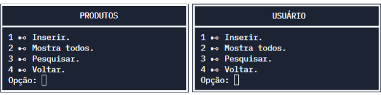

# Lista encadeada em liguagem C
## Selecione o Idioma / Select the language:

### Idioma/language:
1.  [Português](#Português)

2.  [English](#English)

## Português
#### ``@author João Paulo``, Link para executar o projeto no [replit.com](https://replit.com/@JooPaulodaSilv1/ListaEncadeadaExemplo).

Este projeto demonstra a criação e utilização de uma lista encadeada para tipos genéricos com a linguagem c, no qual utiliza de duas ``struct`` e a mesma lista para armazená-las. Para a criação da lista sem a necessidade de um tipo específico nos nós, os mesmos armazenam os endereços com uma variável não definida(``void``). 

A lista encadeada com tipos genéricos usa ponteiro ``*`` e utilizando bibliotecas customizadas ``Exemplo.h``, para uma melhor organização do algoritmo.

### Lista Encadeada:
A lista encadeada é uma lista, no qual o último item inserido torna-se o primeiro da lista. cada dado conhece o endereço do próximo, sendo utilizado para percorrer pela lista.
<p align = center> 

 <p>

**Exemplo de ``struct`` para lista encadeada com inteiros:**

---

```C
// Estrutura da lista encadeada. 
  typedef struct LISTA{
    int valor;
    struct LISTA * proximo;
  }Lista;
```

O ``struct LISTA * proximo;`` armazena o endereço do próximo nó da lista.

---

### Exemplo utilizado neste projeto:

Neste projeto será criado 2 lista encadeada usando a lista genérica que se encontra na pasta ``lista/lista.h`` e ``lista/lista.c``. As lista serão criadas com dois ``typedef struct``, denominados como ``Produto`` e ``Usuario``.

### Generalização dos tipos para armazenar na lista:

Para armazenar os dados na lista de forma genérica, os dados serão armazenados no endereço do tipo ``void``, para apontar para qualquer endereço armazenado na memória. **Exemplo:**  ``void * generico;``.

---

### Adicionando dados ca lista:

Para adicionar valores a lista será utilizado uma variável auxiliar do tipo ``Lista`` para armazenar o início da lista atual. Para encadear a lista é necessário salvar o nó atual antes de atualizar o primeiro da lista. Exemplo:

```C
  Lista * aux = listaAtual;
  listaAtual = novoNó;
  listaAtual->proximo = aux;
```

Com isso no primeiro nó inserido na lista seu próximo apontará para um valor nulo(``NULL``). Sendo utilizado para verificar o final da lista nas interações utilizadas na lista como por exemplo deletar a lista ou mostrar os dados armazenados.

#### Exemplo de uma lista encadeada armazenando dados:

| Posição ao inserir:  |      5      |      4      |      3      |      2      |      1      |
|:--------------------:|:-----------:|:-----------:|:-----------:|:-----------:|:-----------:|
|         Dados:       | ``valor5``  | ``valor4``  | ``valor3``  | ``valor2``  |  ``valor1`` |
| Endereço do próximo: | ``&valor4`` | ``&valor3`` | ``&valor2`` | ``&valor1`` |  ``NULL``   |
|  Posição na lista:   |      0      |      1      |       2     |      3      |      4      |

---

### Percorrendo a lista:

Para percorrer a lista utiliza-se de um loop e uma variável auxiliar para armazenar os nós atuais.

#### Exemplo:
```C
// Exemplo de função que percorre a lista.
  int percorrendoLista(Lista * lista, int i){
	  aux = lista;
  	int posicao = 0;
	  while(aux != NULL){
		  if(posicao == i){
			  return lista->valor;
	  	}
		  aux = aux->proximo;
	  }
	  printf("Posição inválida.");
	  return NULL;
  }
```

#### **Telas do projeto**


##### **Menu Inicial:**


No menu inicial o usuário pode decidir selecionar produtos, usuários ou sair. 

--- 

##### **Menus dos tipos usados, ``Produto`` e ``Usuario``:**



Nesses menus o usuário pode decidir por inserir, mostrar todos os dados, pesquisar ou voltar ao menu inicial. 

---

##### **Inserir Informações dos ``Produtos`` e ``Usuarios``:**


Nessas telas o usuário insere os dados de cada tipo.


###### Exemplo dos menus após inserir:


Após inserir o usuário pode continuar inserindo ou voltar ao menu inicial.

---

##### **Mostrando todos os dados da lista:**


Mostra todos os dados contidos na lista.

---

##### **Telas de pesquisas:**


Nessas telas o usuário pode informar um nome para efetuar a pesquisa.

---

##### **Telas dos resultados das pesquisas:**


A tela de resultados mostra as informações encontradas e oferece opção para deletar o dado da lista.

---

### Conclusão:

A utilização de lista encadeada, ao contrário de vetores, oferece a opção de armazenar os dados de forma dinâmica. Ao contrário de um vetor uma quantidade de dados pré-definida antes de inserir os dados limitando a quantidade ao valor dado para a variável. Exemplo: ``int vetor[10]``, sendo possível armazenar apenas 10 valores, não podendo ser modificado após definir a quantidade de dados do vetor.

## English

#### ``@author João Paulo``, Link to run the project on [replit.com](https://replit.com/@JooPaulodaSilv1/ListaEncadeadaExemplo).

This project demonstrates the creation and use of a linked list for generic types with the c language, in which it uses two ``struct`` and the same list to store them. For the creation of the list without the need for a specific type in the nodes, they store the addresses with an undefined variable (``void``).

The linked list with generic types uses pointer ``*`` and using custom libraries ``Example.h``, for a better organization of the algorithm.

### Linked List:
A linked list is a list, in which the last item entered becomes the first in the list. each piece of data knows the address of the next and is used to scroll through the list.

<p align = center> 

 <p>

**Example of ``struct`` for linked list with integers:**

---

```C
// Linked list structure.
  typedef struct LIST{
    int valor;
    struct LIST * next;
  }List;
```

The ``LIST *next;`` struct stores the address of the next node in the list.

### Example used in this project:

In this project, 2 linked lists will be created using the generic list found in the folders ``lista/lista.h`` and ``lista/lista.c``. The lists will be created with two ``typedef struct``, named as ``Product`` and ``User``.

### Generalization of types to store in the list:

To store the data in the list generically, the data will be stored at address of type ``void``, to point to any address stored in memory. **Example:** ``void * generic;``.

---

### Adding data to the list:

To add values ​​to the list, an auxiliary variable of type ``List`` will be used to store the beginning of the current list. To chain the list it is necessary to save the current node before updating the first one in the list. Example:

```C
  List * aux = CurrentList;
  currentList = newNode;
  CurrentList->next = aux;
```

With that in the first node inserted in the list its next one will point to a null value(``NULL``). Being used to check the end of the list in interactions used in the list, such as deleting the list or showing the stored data.

#### Example of a linked list storing data:

| Position when inserting: | 5 | 4 | 3 | 2 | 1 |
|:--------------------:|:-----------:|:----------- :|:-----------:|:-----------:|:-----------:|
| Data: | ``value5`` | ``value4`` | ``value3`` | ``value2`` | ``value1`` |
| Next Address: | ``&value4`` | ``&value3`` | ``&value2`` | ``&value1`` | ``NULL`` |
| List position: | 0 | 1 | 2 | 3 | 4 |

---

### Cycling through the list:

To traverse the list, we use a loop and an auxiliary variable to store the current nodes.

#### Example:
```C
// Example of function that traverses the list.
  int traversingList(List * list, int i){
aux = list;
  int position = 0;
while(aux != NULL){
if(position == i){
return list->value;
}
aux = aux->next;
}
printf("Invalid position.");
return NULL;
  }
```

#### **Project Screens**


##### **Home Menu:**


From the home menu the user can decide to select products, users or exit.

---

##### **Menus of the types used, ``Product`` and ``User``:**


In these menus the user can decide to enter, show all data, search or return to the main menu.

---

##### **Insert ``Products`` and ``Users`` Information:**


In these screens, the user enters the data of each type.


###### Example of the menus after entering:


After entering the user can continue entering or return to the main menu.

---

##### **Showing all list data:**


Shows all data contained in the list.

---
##### **Survey screens:**


On these screens, the user can enter a name to perform the search.

---

##### **Search Results Screens:**


The results screen shows the information found and offers an option to delete the data from the list.

---

### Conclusion:

Using a linked list, as opposed to arrays, gives you the option of storing data dynamically. Unlike a vector a pre-defined amount of data before entering the data limiting the amount to the given value for the variable. Example: ``int vector[10]``, being possible to store only 10 values, not being able to be modified after defining the amount of vector data.